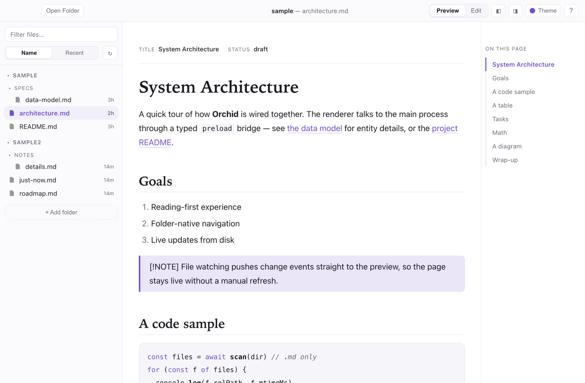
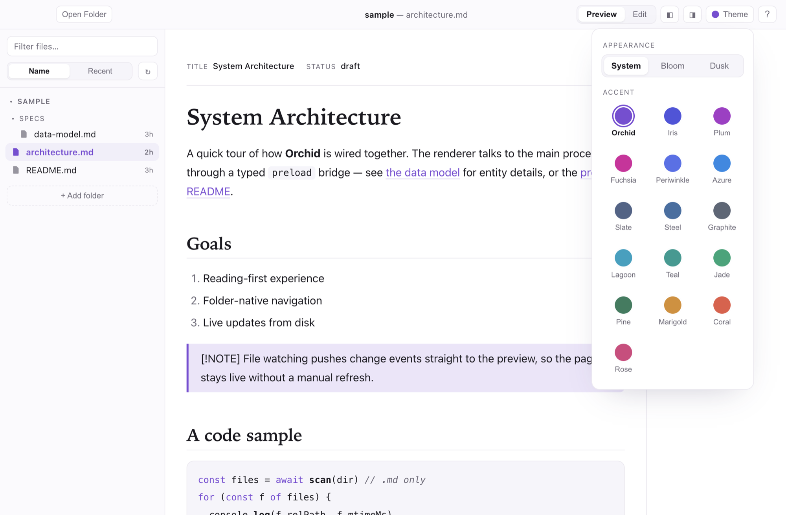
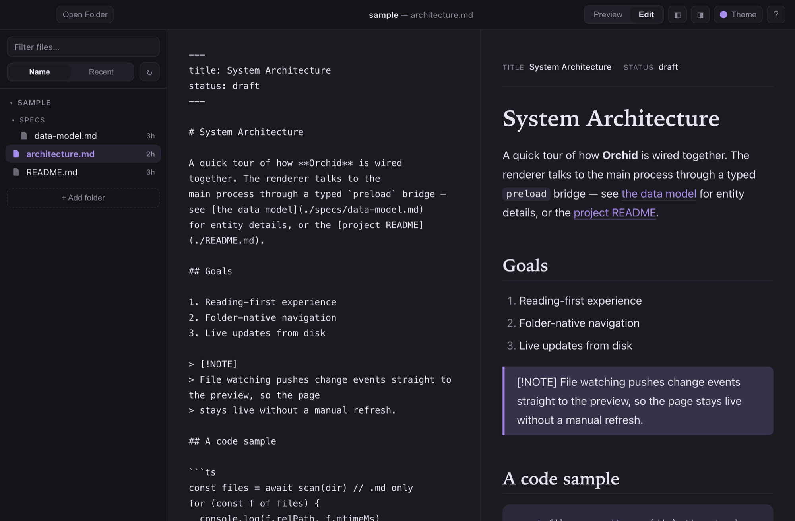

<div align="center">


# Orchid

**A calm, native macOS reader for the Markdown your tools generate.**

Point it at a folder (or several) and Orchid surfaces every Markdown file inside —
beautifully rendered, live-updating, and built for *reading*. Made for the world where
Claude and other tools drop piles of `.md` files that a human needs to browse, preview,
and lightly edit.

[](LICENSE)
-555.svg)


</div>

---

<div align="center">

</div>

## Features

**Navigate**
- **Folder-native** — open a folder and the sidebar shows *only* Markdown (`.md`, `.markdown`, `.mdx`), nested structure preserved, noise (`node_modules`, dotfiles) hidden.
- **Multi-folder workspaces** — keep several folders open at once, each as its own collapsible section. Add or remove folders any time.
- **Open a single file** too, when you don't need a whole folder.
- **Recency-aware** — files touched in the last few minutes get a dot; older ones show their age. Sort by **Name** or **Recent**.
- **Live** — new and changed files appear automatically (filesystem-watched); a **Refresh** button re-scans on demand.
- **Find fast** — `⌘P` fuzzy file switcher · `⌘⇧F` full-text search across every open folder · a scroll-spy table-of-contents rail.

**Read**
- **Rich preview** — GFM tables, task lists, syntax-highlighted code, blockquotes & callouts, images, a tidy frontmatter header, **KaTeX math**, and **Mermaid diagrams**.
- **Built for focus** — refined editorial typography; hide the sidebar (`⌘.`) and contents rail (`⌘⌥.`) for full-width reading.
- **Themes** — light (*Bloom*) / dark (*Dusk*) following the system, plus **16 accent presets** (warm, cool & neutral). The whole UI — and the logo — recolor live; your choice persists.

**Edit & export**
- **Light editing** — `⌘E` toggles a CodeMirror editor with a scroll-synced live preview; `⌘S` saves. External edits reload live, with a conflict banner if you have unsaved changes.
- **Export** any file to a self-contained **HTML** or **PDF** (current theme embedded).

### Light &amp; dark

Orchid follows your system appearance — **Bloom** (light) and **Dusk** (dark) — or pin either.

<div align="center">

<br/><em>Dusk — the same document in dark mode</em>
</div>

### More

<div align="center">

<br/><em>Multi-folder workspaces · recency badges · contents rail</em>
<br/><br/>

<br/><em>16 live accent presets — warm, cool &amp; neutral</em>
<br/><br/>

<br/><em>CodeMirror editor with scroll-synced live preview</em>
</div>

## Install

> **Requires macOS on Apple Silicon** (M1 / M2 / M3 / M4).

**1. Download** the latest **`Orchid-0.1.1-arm64.dmg`** from the [**Releases**](https://github.com/avnat/orchid/releases/latest) page.

**2. Install** — open the downloaded `.dmg`, then drag the **Orchid** icon onto the **Applications** folder shown in the window.

**3. Open it the first time** (one-time, ~15 seconds):

Orchid is a free, open-source app that isn't paid-signed by Apple, so macOS double-checks with you on the *very first* open. This is normal and safe — just follow these clicks:

   1. In **Applications**, double-click **Orchid**.
   2. A box says *“Apple could not verify ‘Orchid’ is free of malware…”* → click **Done**. *(Do **not** click “Move to Bin”.)*
   3. Open the  **Apple menu  → System Settings → Privacy & Security**.
   4. Scroll down to the **Security** section — you'll see *“Orchid was blocked to protect your Mac.”* → click **Open Anyway**.
   5. Confirm with **Open Anyway**, then Touch ID / your password if asked.

That's it — from now on Orchid opens with a normal double-click. ✨

<details>
<summary>Rare: it says “damaged” or still won't open</summary>

If the download's quarantine flag got stuck, open the **Terminal** app (⌘Space → type “Terminal”) and paste:

```bash
xattr -dr com.apple.quarantine /Applications/Orchid.app
```

Press Return, then open Orchid normally. You only ever need this once.
</details>

## Keyboard shortcuts

| Action | Shortcut |
|---|---|
| Open a folder | `⌘O` |
| Add a folder to the workspace | `⇧⌘O` |
| Open a single file | `⌃⌘O` |
| Refresh (re-scan folders) | `⌘R` |
| Jump to a file | `⌘P` |
| Find in files | `⌘⇧F` |
| Preview ⇄ Edit | `⌘E` |
| Save | `⌘S` |
| Toggle sidebar | `⌘.` |
| Toggle contents rail | `⌘⌥.` |
| Keyboard shortcuts | `⌘/` |

> Tip: drag a folder or file onto the window, or right-click a file to reveal it in Finder.

## Build from source

```bash
git clone https://github.com/avnat/orchid.git
cd orchid
npm install
npm run dev      # launch with hot reload
npm run build    # bundle to out/
npm run dist     # package a .dmg (arm64, ad-hoc signed) into dist/
```

**Stack:** Electron · TypeScript · React · Vite (electron-vite) · react-markdown
(remark/rehype) · KaTeX · Mermaid · CodeMirror 6 · chokidar · Zustand.

```
src/main/      Electron main: window, menu, fs scan, chokidar watcher, IPC, image protocol
src/preload/   Typed contextBridge API (sandboxed)
src/renderer/  React UI: sidebar, preview/editor, markdown pipeline, store, themes
```

See [`CONCEPT.md`](CONCEPT.md) for the full design rationale.

## Contributing

Issues and PRs welcome. Run `npm run typecheck` before pushing.

## License

[MIT](LICENSE) © 2026 Avnee.

<div align="center"><sub>Concept by Avnee · Built by Claude 🌸</sub></div>
