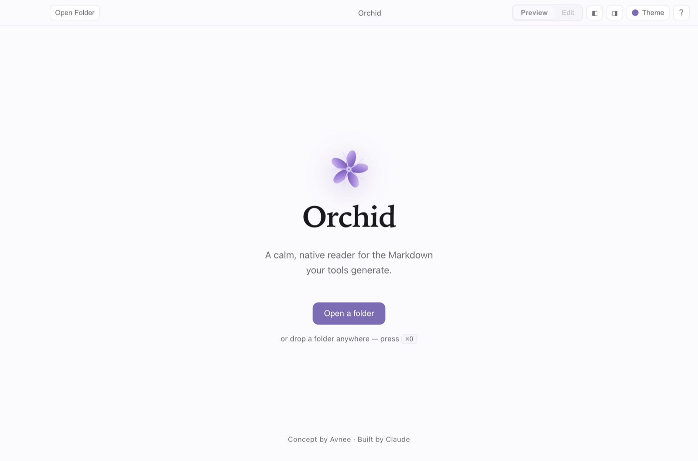
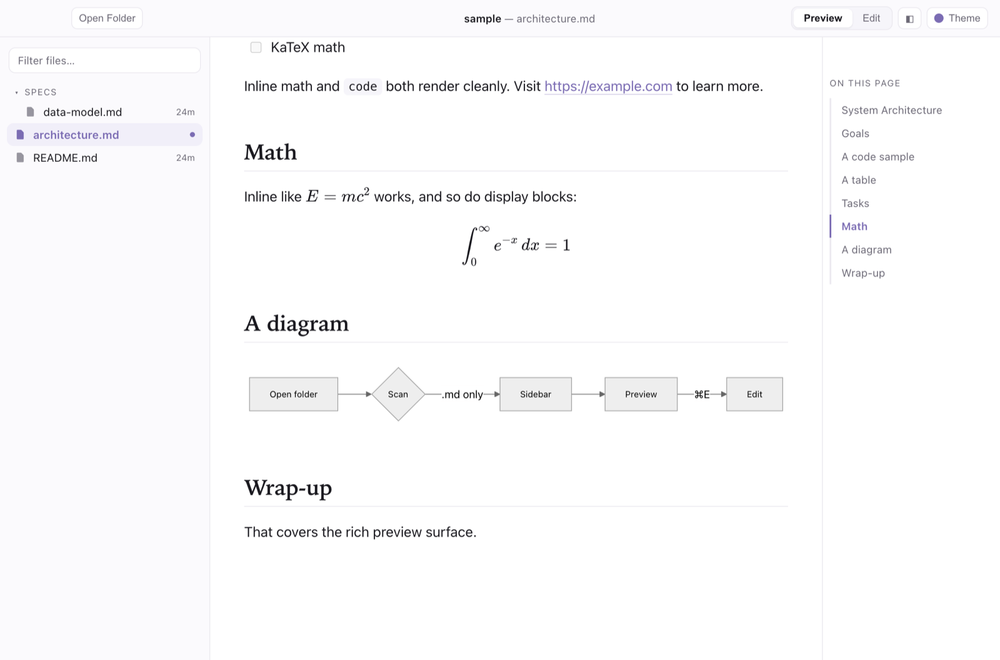

<div align="center">


# Orchid

**A calm, native macOS reader for the Markdown your tools generate.**

Open a folder, and Orchid surfaces every Markdown file inside — beautifully rendered,
live-updating, and built for *reading*. Made for the world where Claude (and other tools)
emit piles of `.md` files that a human needs to browse, preview, and lightly edit.

[](LICENSE)
-555.svg)


</div>

---

<div align="center">

</div>

## Why Orchid

Most Markdown apps treat the preview as a sidecar to the editor. Orchid inverts that — **the
preview is the product**. The unit of work is a *folder*, not a single file: point Orchid at a
directory and it becomes a quiet, gorgeous reading surface for everything inside, updating
itself the moment a file changes on disk.

## Features

- 📂 **Folder-native** — open a folder; the sidebar shows **only** Markdown (`.md`, `.markdown`,
  `.mdx`), nested structure preserved, noise (`node_modules`, dotfiles…) hidden.
- ✨ **Rich preview** — GFM tables, task lists, syntax-highlighted code, blockquotes, images,
  a tidy frontmatter header, **KaTeX math**, and **Mermaid diagrams**.
- 🕐 **Recency-aware** — files touched in the last few minutes get an accent dot; older ones show
  their age, so you instantly see what your tools just wrote.
- 🔎 **Fast navigation** — `⌘P` fuzzy file switcher, `⌘⇧F` full-text search across the folder,
  and a scroll-spy **table of contents** rail.
- 🎨 **Configurable themes** — light (*Bloom*) / dark (*Dusk*) following the system, plus **12
  accent presets** (the whole UI, and the logo, recolor live).
- 📝 **Light editing** — `⌘E` toggles a CodeMirror 6 editor with a scroll-synced live preview;
  `⌘S` saves. External changes reload live, with a conflict banner if you have unsaved edits.
- 🖥️ **Quietly native** — real macOS window, menus, dark mode, full-bleed focus reading.
- 📄 **Export** — render any file to a self-contained **HTML** or **PDF** (theme embedded).

<div align="center">

<br/><em>Rich preview — math, Mermaid, and the scroll-spy contents rail</em>
<br/><br/>

<br/><em>12 live accent presets, light & dark</em>
<br/><br/>

<br/><em>CodeMirror editor with scroll-synced preview (Dusk)</em>
</div>

## Install

> **Requires:** macOS on **Apple Silicon** (M1/M2/M3/M4).

1. Download the latest **`Orchid-*.dmg`** from the [**Releases**](https://github.com/avnat/orchid/releases/latest) page.
2. Open the `.dmg` and drag **Orchid** into **Applications**.
3. First launch is blocked by Gatekeeper (the app is unsigned). Get past it once:
   - **System Settings → Privacy & Security**, scroll to *"Orchid was blocked"* → **Open Anyway**, or
   - in Terminal: `xattr -dr com.apple.quarantine /Applications/Orchid.app`

After that it opens normally.

## Keyboard shortcuts

| | |
|---|---|
| Open a folder | `⌘O` |
| Jump to a file | `⌘P` |
| Find in files | `⌘⇧F` |
| Preview ⇄ Edit | `⌘E` |
| Save | `⌘S` |
| Toggle sidebar | `⌘.` |
| Toggle contents | `⌘⌥.` |
| Keyboard shortcuts | `⌘/` |

## Build from source

```bash
git clone https://github.com/avnat/orchid.git
cd orchid
npm install
npm run dev      # launch with hot reload
npm run build    # bundle to out/
npm run dist     # package a .dmg (arm64, unsigned) into dist/
```

**Stack:** Electron · TypeScript · React · Vite (electron-vite) · react-markdown
(remark/rehype) · KaTeX · Mermaid · CodeMirror 6 · chokidar · Zustand.

```
src/main/      Electron main: window, menu, fs scan, chokidar watcher, IPC, image protocol
src/preload/   Typed contextBridge API (sandboxed)
src/renderer/  React UI: sidebar, preview/editor, markdown pipeline, store, themes
```

See [`CONCEPT.md`](CONCEPT.md) for the full design rationale and roadmap.

## Contributing

Issues and PRs welcome. Run `npm run typecheck` before pushing.

## License

[MIT](LICENSE) © 2026 Avnee.

<div align="center"><sub>Concept by Avnee · Built by Claude 🌸</sub></div>
