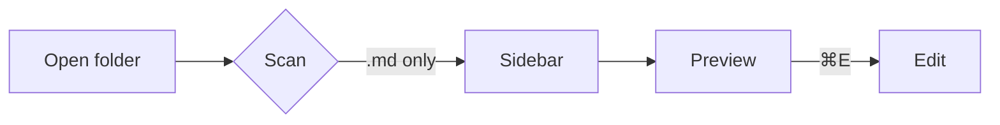

# System Architecture

A quick tour of how **Orchid** is wired together. The renderer talks to the
main process through a typed `preload` bridge — see [the data model](./specs/data-model.md)
for entity details, or the [project README](./README.md).

## Goals

1. Reading-first experience
2. Folder-native navigation
3. Live updates from disk

> [!NOTE]
> File watching pushes change events straight to the preview, so the page
> stays live without a manual refresh.

## A code sample

```ts
const files = await scan(dir) // .md only
for (const f of files) {
  console.log(f.relPath, f.mtimeMs)
}
```

## A table

| Phase | Outcome              | Status |
| ----- | -------------------- | ------ |
| 0     | Browse a folder      | done   |
| 1     | Beautiful preview    | done   |
| 2     | Live + light editing | next   |

## Tasks

- [x] Recursive markdown scan
- [x] Recency badges in the sidebar
- [ ] Mermaid diagrams
- [ ] KaTeX math

Inline math and `code` both render cleanly. Visit <https://example.com> to learn more.

## Math

Inline like $E = mc^2$ works, and so do display blocks:

$$
\int_0^\infty e^{-x}\,dx = 1
$$

## A diagram



## Wrap-up

That covers the rich preview surface.
