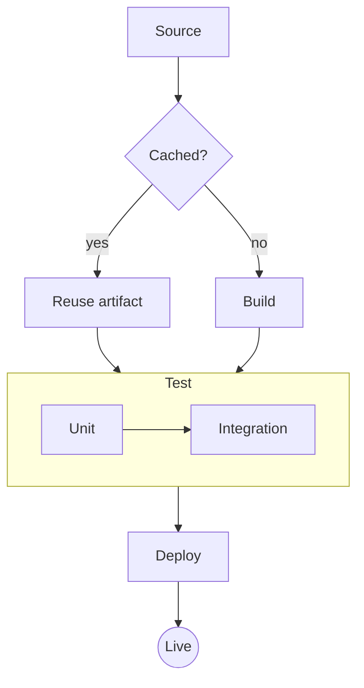

# Pipeline — Design Notes

A small demo document — and, conveniently, a tour of what Orchid can render. Everything
below is live Markdown: tables, math, diagrams, syntax-highlighted code, and task lists.

> [!NOTE]
> This file ships with Orchid as a sample. Open the `sample/` folder to explore it,
> or point Orchid at your own folder of Markdown.

## How the stages connect



## Stages at a glance

| Stage  | Input          | Output        | Typical time |
| ------ | -------------- | ------------- | ------------ |
| Source | Repository     | Working tree  | instant      |
| Build  | Working tree   | Artifact      | ~30 s        |
| Test   | Artifact       | Report        | ~45 s        |
| Deploy | Report + build | Live release  | ~20 s        |

The estimated wait blends queue time with run time:

$$
\text{wait} = q + \sum_{i=1}^{n} \frac{t_i}{p}
$$

where $q$ is queue delay, $t_i$ each stage's duration, and $p$ the number of parallel workers.

## A representative slice

```ts
interface StageResult {
  name: string
  ok: boolean
  durationMs: number
}

function run(stages: Stage[]): StageResult[] {
  return stages.map((s) => {
    const start = now()
    const ok = s.execute()
    return { name: s.name, ok, durationMs: now() - start }
  })
}
```

## Status

- [x] Source and build stages
- [x] Parallel test runners
- [ ] Incremental artifact cache
- [ ] Deploy previews per branch

See the [project README](./README.md) for the full picture.
